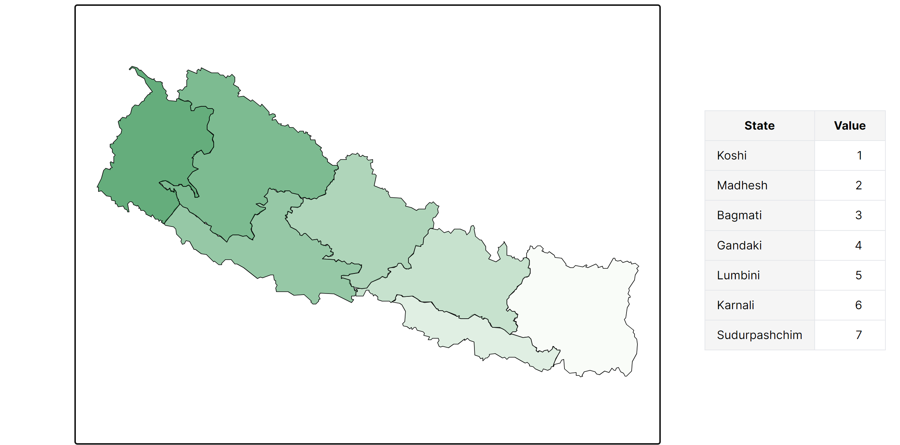

# Nepal By Numbers

## Overview

**Nepal By Numbers** is a cutting-edge map visualization tool designed to provide comprehensive and insightful data visualizations for Nepal. This powerful application focuses on various statistical factors, offering users an intuitive and interactive way to explore key data points such as GDP, HDI, and other crucial statistics through dynamic map visualizations.

## Table of Contents

1. [Features](#features)
2. [Preview](#preview)
3. [Installation](#installation)
4. [Usage Guide](#usage-guide)
5. [Data Integration](#data-integration)
6. [Customization Options](#customization-options)
7. [Export and Sharing](#export-and-sharing)
8. [Technical Architecture](#technical-architecture)
9. [Contributing](#contributing)
10. [Troubleshooting](#troubleshooting)
11. [License](#license)
12. [Contact and Support](#contact-and-support)

## Features

### 1. Comprehensive Map Visualizations

- **Multi-level Geographical Boundaries**: Visualize data across various administrative levels including provinces, districts, and municipalities.
- **Interactive Elements**: Hover and click functionality for detailed information display.
- **Dynamic Legend**: Auto-adjusting legend based on data ranges and classification methods.

### 2. Data Integration

- **Excel Integration**: Seamlessly import data from Excel files with a single click.
- **CSV Support**: Flexible data import using CSV format for wider compatibility.
- **Real-time Updates**: Visualizations update instantly as new data is imported or modified.

### 3. Visualization Techniques

- **Classification Maps**: Categorize data into distinct groups for easy comparison.
- **Regression Maps**: Display continuous data with smooth color gradients.
- **Customizable Color Schemes**: Choose from a variety of color palettes or create your own.

### 4. Customization and Theming

- **Multiple Pre-designed Themes**: Select from a range of professional themes to match your presentation style.
- **Custom Styling Options**: Adjust colors and layout elements to create unique visualizations.

### 5. Export and Sharing

- **High-Resolution Export**: Generate publication-quality maps and infographics.
- **PNG Format Support**: Export as PNG various use cases.

### 6. Project Management

- **Save and Load Projects**: Preserve your work and settings for future sessions.

## Preview

### Regression Style Map



### Classification Style Map


## Installation

To set up Nepal By Numbers locally, follow these steps:

1. **Clone the Repository**

   ```bash
   git clone git@github.com:iaavas/nepalbynumbers.git
   ```

2. **Navigate to Project Directory**

   ```bash
   cd nepalbynumbers
   ```

3. **Install Dependencies**

   ```bash
   npm install
   ```

4. **Set Up Environment Variables**

   - Copy `.env.example` to `.env`
   - Update the variables in `.env` with your specific configuration

5. **Run the Development Server**

   ```bash
   npm run dev
   ```

6. **Access the Application**
   Open your browser and visit `http://localhost:3000`

## Usage Guide

1. **Data Import**

   - Select your Excel or CSV file containing Nepal-specific data
   - Map the columns to corresponding geographical entities

2. **Choosing Visualization Type**

   - Based on your data webapp automatically assign it as "Regression" or "Classification"

3. **Customizing the Map**

   - Use the "Themes" dropdown to select a pre-designed look
   - Fine-tune colors, labels, and other visual elements in the "Customization" panel

4. **Interacting with the Map**

   - Hover over regions to see quick stats
   - Click on a region for detailed information and additional charts

5. **Exporting Your Work**
   - Click "Export" in the top menu
   - Choose your desired format and resolution
   - Save the file to your local machine

## Data Integration

### Supported Formats

- Excel (.xlsx, .xls)
- CSV (.csv)
- JSON (via API integration)

### Data Structure Requirements

- First column: Unique identifier for each geographical entity (e.g., district code)
- Subsequent columns: Statistical data (e.g., population, GDP, literacy rate)

## Customization Options

### Theme Customization

- **Color Palettes**: Choose from 7+ pre-defined palettes or create custom ones
- **Layout**: Adjust map positioning, legend placement, and information panel design

## Export and Sharing

### Export Formats

- PNG: For web and general-purpose use

## Technical Architecture

Nepal By Numbers is built on a modern, scalable architecture:

- **Frontend**: React.js with Next.js for server-side rendering
- **Map Rendering**: D3.js for SVG manipulation, Leaflet for base maps
- **Backend**: Node.js with Express, handling data processing and API requests
- **Database**: Firebase for storing user projects and cached data

## Contributing

We welcome contributions from the community! Here's how you can help:

1. **Fork the Repository**
2. **Create a Feature Branch**
   ```bash
   git checkout -b feature/AmazingFeature
   ```
3. **Commit Your Changes**
   ```bash
   git commit -m 'Add some AmazingFeature'
   ```
4. **Push to the Branch**
   ```bash
   git push origin feature/AmazingFeature
   ```
5. **Open a Pull Request**

## Troubleshooting

### Common Issues and Solutions

1. **Map Not Rendering**

   - Ensure your browser supports SVG rendering
   - Clear your browser cache and reload the page
   - Check console for any JavaScript errors

2. **Data Import Failures**

   - Verify your Excel/CSV file structure matches our template
   - Ensure all geographical identifiers are correct and recognized

## License

This project is licensed under the MIT License. See the [LICENSE](LICENSE) file for details.

## Contact and Support

- **Documentation**: [Full Documentation](https://iaavas.github.io/nepalbynumbers/)
- **Issue Tracker**: [GitHub Issues](https://github.com/iaavas/nepalbynumbers/issues)
- **Email Support**: baralaavas@gmail.com

---

By providing this comprehensive documentation, we aim to empower users and contributors with all the necessary information to effectively use and enhance Nepal By Numbers. We're committed to maintaining this documentation and welcome feedback for continuous improvement.
